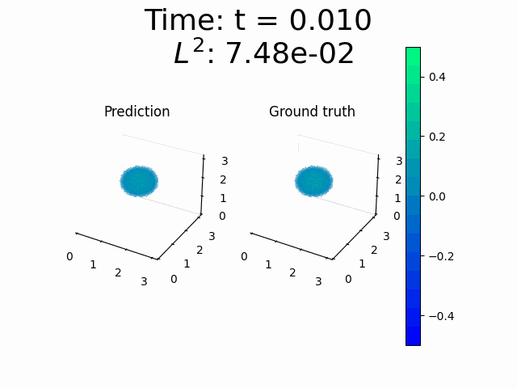
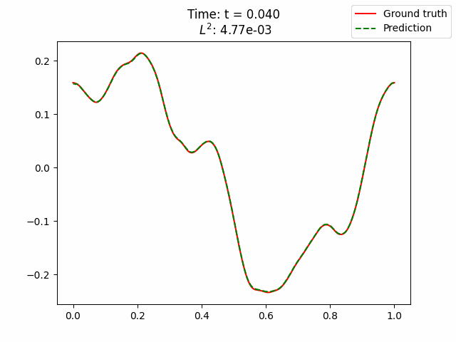

# TC-UNet

This repo contains the code for our paper:  
[**Real-time inference and extrapolation with Time-Conditioned UNet: Applications in hypersonic flows, incompressible flows, and global temperature forecasting
**](https://www.sciencedirect.com/science/article/pii/S0045782525002543?via%3Dihub)  
([arXiv version here](https://arxiv.org/abs/2307.09072))


<!-- ## Navier-Stokes


## Hypersonic flow


## Wave 3D



## Wave 2D


## Burgers'

 -->

---

> **Abstract**  
Neural Operators are fast and accurate surrogates for nonlinear mappings between functional spaces within training domains. Extrapolation beyond the training domain remains a grand challenge across all application areas. We present Time-Conditioned UNet (TC-UNet) as an operator learning method to solve time-dependent PDEs continuously in time without any temporal discretization, including in extrapolation scenarios. TC-UNet incorporates the temporal evolution of the PDE into its architecture by combining a parameter conditioning approach with the attention mechanism from the Transformer architecture. After training, TC-UNet makes real-time inferences on an arbitrary temporal grid. We demonstrate its extrapolation capability on a climate problem by estimating the global temperature for several years and also for inviscid hypersonic flow around a double cone. We propose different training strategies involving temporal bundling and sub-sampling. We demonstrate performance improvements for several benchmarks, performing extrapolation for long time intervals and zero-shot super-resolution time.

<h3>Navier-Stokes Example</h3>
<p float="center">
  
</p>

---
### Installation

To install all dependencies, run:

```bash
pip install -r requirements.txt
```

---

### Code Structure

The main code lives in the `src/` folder.

- The entry point is: `src/ditto/main_local.py`  
- Configurations for experiments are in: `src/configs/`

You can control experiments by:
1. Editing the config files to set parameters.
2. Choosing the relevant `run()` function inside `main_local.py`.

---

### Quick Start

A ready-to-run example is already set up using the **TC-UNet-s** model (`ditto_subsampled_X10`) on the **Navier-Stokes** equation with **N = 1000** initial conditions.

You’ll find everything pre-configured in:
- `src/ditto/main_local.py`
- `src/configs/navier_stokes.py`

Just run:

```bash
python src/ditto/main_local.py
```

After training, results and the saved model will appear in a new folder called `outputs/`.

## TC-UNet in Action

<h3>Hypersonic Flow</h3>
<p float="center">
  
</p>


<h3>Wave 3D & Wave 2D</h3>
<p float="left">
  
  
</p>

<h3>Burgers' Equation</h3>
<p float="center">
  
</p>